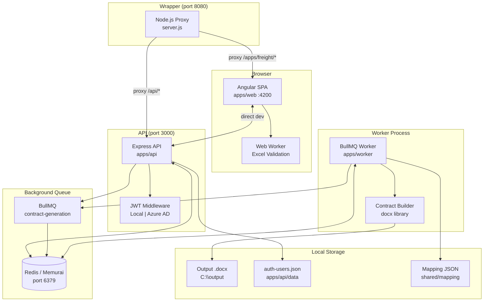
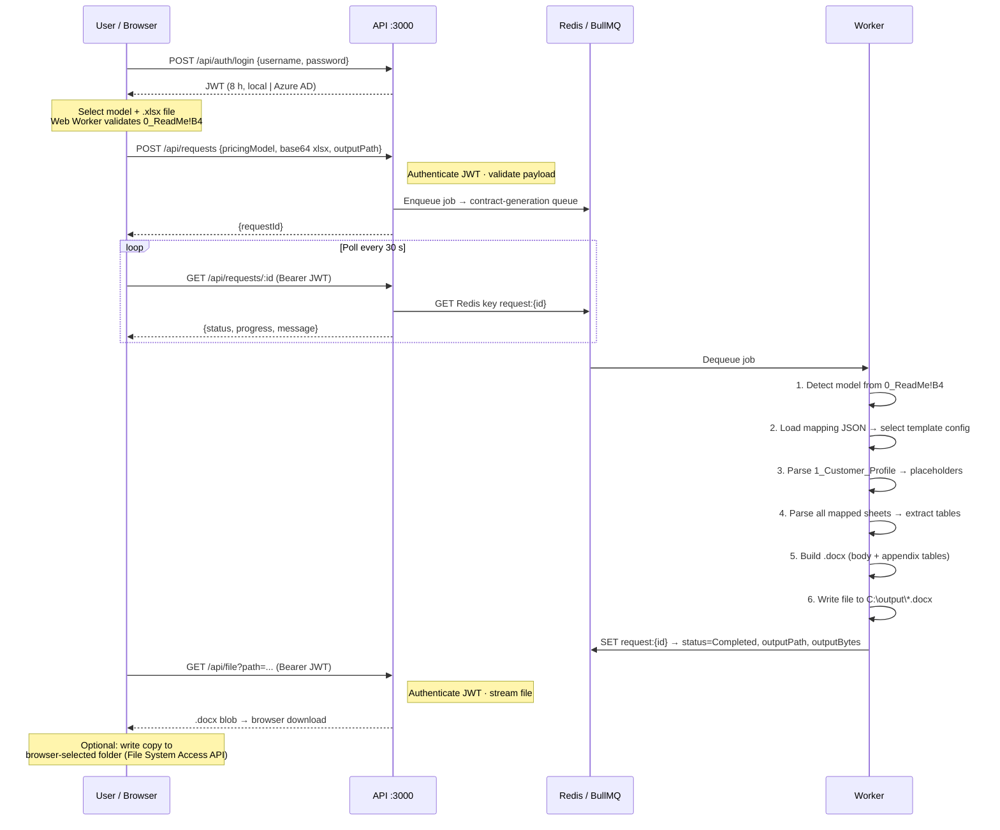

# Freight Pricing Contract Generator — Current App Specification

> Purpose: generate a Word contract from a Freight Pricing Excel workbook using a mapping-driven worker pipeline. The current implementation is optimized for local testing and internal use: authentication is temporarily bypassed, the input workbook is selected from the local machine, and output is written to a local filesystem path with optional browser-folder write-back.

## 1. Current Scope

The application supports two pricing models:
- Zone-based
- Mileage-based

The authoritative mapping artifact is:
- `shared/mapping/PricingTemplate_To_Contract_Mapping.json`

The generated document is built programmatically with `docx`; the flow does not currently depend on uploading the result to OneDrive.

## 2. Implemented User Experience

The app uses a single Angular page with Angular Material controls and a light theme.

Primary flow:
1. Select `Pricing Model`
2. Browse and choose a local `.xlsx` workbook from the local drive
3. Optionally choose a browser-writable output folder using the File System Access API
4. Review the generated output file name
5. Validate the workbook against the selected pricing model
6. Submit the request
7. Watch request status and open the generated document when complete

UI behavior:
- Validation and submit actions are visibly separated from the form
- Layout spacing was widened to prevent overlap between the pricing model control and the input section
- Angular Material overlays were restyled for the light theme
- The validation trace viewer was removed from the page; diagnostic traces remain in the browser console

## 3. Functional Requirements

### 3.1 Authentication

Current state:
- Front-end and API run with authentication bypass enabled for local testing
- `@azure/msal-browser` remains available for future Graph-based flows
- User authentication is the only intentionally bypassed area

Future-compatible behavior:
- The worker and API can still support Graph/OBO style flows later, but local input/output is the active path

### 3.2 Input Selection

Input is selected from the local machine, not from OneDrive.

Requirements:
- Input file must be an `.xlsx`
- The browser reads the selected file and submits it as base64 content to the API
- The selected file name is preserved for status and output naming

### 3.3 Output Selection

Current output behavior:
- Default output target is a local folder path
- Default business output folder: `C:\output`
- The browser may optionally store a directory handle from `showDirectoryPicker()` and write the generated `.docx` back into that folder after job completion
- The backend always writes a filesystem copy so the result exists even when browser folder write-back is unavailable

Default output file naming:
- `<input-base-name>_Contract_CCYY-MM-DD-HHMMSS.docx`

### 3.4 Front-end Validation

Validation is intentionally simple and fast.

Current rule:
- Read `0_ReadMe!B4`
- Compare the value to the selected pricing model

Implementation details:
- Validation runs in a browser Web Worker to avoid blocking the UI
- The UI records validation duration in milliseconds
- A slow-file warning is shown when validation exceeds the configured threshold
- Timeout protection prevents the validation spinner from hanging indefinitely

Validation result behavior:
- On success, the page shows a success message and timing metric
- On mismatch or invalid workbook, the page shows an inline error and keeps submit disabled

### 3.5 Submission

When validation passes, the front end submits:

```json
{
  "pricingModel": "Zone-based|Mileage-based",
  "input": {
    "name": "input.xlsx",
    "contentBase64": "..."
  },
  "output": {
    "localPath": "C:\\output",
    "fileName": "Customer_Contract_2026-04-02-143005.docx"
  }
}
```

The API accepts the request quickly, enqueues background work, and returns a request identifier.

### 3.6 Async Processing and Status

Background execution uses BullMQ with a Redis-compatible backend.

Current runtime expectation:
- Redis-compatible service version must satisfy BullMQ requirements; Memurai is being used locally as the Redis-compatible backend

Status flow:
- `Queued`
- `Processing`
- `Completed` or `Failed`

Front-end polling behavior:
- Poll every 30 seconds
- Start polling immediately after submission using an immediate first tick
- Keep the UI in sync with Angular `NgZone` and change detection fixes so status and completion render reliably

On completion:
- The UI confirms document generation
- The page can open/download the generated document
- If browser folder access was granted and output bytes are returned, the page attempts to write the file into the user-selected folder as well

### 3.7 Worker Merge Logic

For each request, the worker:
1. Loads the mapping JSON
2. Selects the correct template definition by pricing model / detected workbook content
3. Reads the uploaded workbook with ExcelJS
4. Extracts placeholder values from `1_Customer_Profile`
5. Extracts mapped tables from the configured worksheets
6. Builds a `.docx` contract with `docx`
7. Writes the result to the requested local filesystem path
8. Stores job status, output path, and output bytes for retrieval

### 3.8 Multi-table Worksheet Extraction

The workbook parser was updated to handle worksheets that contain more than one table.

Current extraction rules:
- A mapped table may declare a `tableDelimiter`
- Supported delimiter patterns include:
  - `emptyLine`
  - `newHeader`
- Parsing stops not only on blank separators, but also when another known header block is detected later on the same sheet

This behavior was added specifically to avoid merging unrelated tables such as those on `2_Lanes_Locations`.

### 3.9 Word Table Rendering

The generated Word document must preserve table structure even when some trailing cells are empty.

Implemented rendering rules:
- Normalize each table row to the maximum detected column count
- Use fixed table layout
- Fill otherwise empty visible cells with non-breaking spaces so table borders render consistently
- Apply full inside and outside borders to generated tables

## 4. Non-Functional Requirements

### 4.1 Performance
- Validation must stay off the main thread
- Large workbook submit payloads must be accepted by the API
- Status must appear immediately after submit rather than waiting for the first 30-second interval

### 4.2 Reliability
- Validation and submission spinners must not hang indefinitely
- API body size must support workbook uploads
- Backend writes a local output copy even if browser folder write-back is unavailable

### 4.3 Observability
- API and worker log lifecycle events
- Browser console logs remain available for validation tracing and timing
- User-facing status messages should be simple and readable

## 5. Implemented Architecture

### 5.1 Front-end

App:
- Angular standalone app in `apps/web`

Key services/components:
- `HomeComponent` handles the end-to-end workflow
- `ExcelValidationService` validates workbook content using a Web Worker
- `RequestsApiService` submits requests, polls status, and opens generated files
- `AuthService` retains the structure for MSAL-based auth but currently operates in bypass mode

Theme:
- Angular Material with custom light-theme overrides

### 5.2 API

App:
- Express API in `apps/api`

Endpoints:
- `POST /api/requests`
- `GET /api/requests/:id`
- `GET /api/file?path=...`

API responsibilities:
- accept base64 workbook input
- validate the payload
- enqueue background processing
- return status data including progress and output metadata
- stream completed files back to the browser

Operational details:
- JSON request size limit is increased to handle workbook payloads
- Localhost CORS is configured for the Angular app
- Authentication bypass is enabled by default for local development

### 5.3 Worker

App:
- BullMQ worker in `apps/worker`

Responsibilities:
- decode local workbook input
- optionally support Graph/OBO flow when enabled later
- parse workbook data with ExcelJS
- generate the Word document with `docx`
- persist status updates, output path, and output bytes

## 6. Data Contracts

### 6.1 Request

```json
{
  "pricingModel": "Zone-based|Mileage-based",
  "input": {
    "name": "input.xlsx",
    "contentBase64": "..."
  },
  "output": {
    "localPath": "C:\\output",
    "fileName": "input_Contract_2026-04-02-143005.docx"
  }
}
```

### 6.2 Status

```json
{
  "requestId": "uuid",
  "status": "Queued|Processing|Completed|Failed",
  "progress": 0,
  "message": "human readable",
  "outputPath": "C:\\...\\input_Contract_2026-04-02-143005.docx",
  "outputBase64": "...",
  "error": {
    "code": "...",
    "details": "..."
  }
}
```

## 7. Acceptance Criteria

1. Selecting a workbook whose `0_ReadMe!B4` value does not match the dropdown must show a validation error and disable submit.
2. Validation must complete without freezing the page.
3. Submit must immediately show status/progress UI.
4. Completed jobs must produce a `.docx` in the configured local output path.
5. Generated Word tables must keep borders even when the source table has blank cells.
6. Multi-table worksheets must not merge adjacent logical tables into one output table.

## 8. Validation Rules

### 8.1 Client-side
- pricingModel required
- inputFile required
- outputFolder required
- Excel detection:
  - `_Meta.TemplateID` matches expected
  - else `0_ReadMe!B4` equals pricingModel

### 8.2 Server-side
Repeat validation server-side; never trust client.

## 9. Merge Algorithm (Pseudo)

1. Read mapping JSON
2. Determine template entry
3. Download xlsx
4. Parse workbook
5. Build contract document:
   - Fill body placeholders
   - For each table mapping:
     - locate header row
     - extract contiguous rows
     - build Word table
6. Upload docx
7. Update status with output link

---

## 10. System Architecture Diagram



---

## 11. End-to-End Request Flow



---

## 12. Adding a New Template / Document Type

Follow these steps to add support for a new pricing model or contract variant
(e.g. `Air-based`, `Rail-based`, or a region-specific variant).

### Step 12.1 — Create the Word contract template

1. Copy an existing template as a starting point:
   ```
   shared/contracts/Freight_Logistics_Contract_ZONE_AllTables.docx
   ```
2. Edit the copy to reflect the new contract structure.
3. Insert `{{PlaceholderName}}` tokens in the body for every dynamic field
   (the token names must match those declared in Step 12.3).
4. Save the new file in `shared/contracts/`:
   ```
   shared/contracts/Freight_Logistics_Contract_<MODEL>_AllTables.docx
   ```

> The contract builder in `apps/worker/src/contract-builder.ts` uses the
> `CONTRACT_BODY_TEMPLATE` array for the body text.  If the new contract
> needs a fundamentally different body, add a new template string array
> keyed by `templateId` and select it at runtime.

### Step 12.2 — Prepare the Excel input template

The Excel workbook used by end-users must contain:

| Sheet | Required content |
|-------|-----------------|
| `_Meta` | Cell with `TemplateID` key and the new `templateId` value |
| `0_ReadMe` | Cell `B4` containing the human-readable pricing model label |
| `1_Customer_Profile` | Field/Value rows for all customer and contract metadata |
| `2_Lanes_Locations` … `N_SheetName` | Data tables as needed |

### Step 12.3 — Add a mapping entry to the JSON

Open `shared/mapping/PricingTemplate_To_Contract_Mapping.json` and append a
new entry inside the `"templates"` array:

```jsonc
{
  "templateId": "FREIGHT_PRICING_AIR",          // unique ID matching _Meta sheet
  "pricingModel": "Air-based",                  // label shown in the UI
  "detection": {
    "primary":   { "sheet": "_Meta",             "key":   "TemplateID",   "expected": "FREIGHT_PRICING_AIR" },
    "secondary": { "sheet": "0_ReadMe",          "cell":  "B4",           "expected": "Air-based" },
    "tertiary":  { "sheet": "1_Customer_Profile","field": "Pricing Model","expected": "Air-based" }
  },
  "artifacts": {
    "excel":    "Freight_Pricing_Contract_Template_AIR.xlsx",
    "contract": "Freight_Logistics_Contract_AIR_AllTables.docx"  // file created in 12.1
  },
  "placeholders": {
    "{{PricingModel}}": {
      "preferred": { "sheet": "0_ReadMe",          "cell":  "B4" },
      "fallback":  { "sheet": "1_Customer_Profile","field": "Pricing Model" }
    },
    "{{CustomerName}}":    { "sheet": "1_Customer_Profile", "field": "Customer Legal Name" },
    "{{StartDate}}":       { "sheet": "1_Customer_Profile", "field": "Contract Effective Start Date" },
    // … add/remove placeholders to match the contract body tokens
  },
  "tables": [
    {
      "name": "Customer_Profile",
      "sheet": "1_Customer_Profile",
      "headerRow": 1,
      "contractSection": "Appendix 1"
    },
    {
      "name": "Air_Lanes",
      "sheet": "2_Air_Lanes",
      "headerRow": 1,
      "contractSection": "Appendix 2"
    }
    // … one entry per worksheet that should appear in the generated document
  ]
}
```

### Step 12.4 — Add the model to the Angular dropdown

In `apps/web/src/app/home.component.ts`, add the new label to the
`pricingModels` array:

```typescript
pricingModels = ['Zone-based', 'Mileage-based', 'Air-based'];
```

### Step 12.5 — Update detection in the worker (if needed)

If the new pricing model string is not already handled by
`detectPricingModelFromWorkbook` in `apps/worker/src/worker.ts`, extend the
`if` chain:

```typescript
if (b4.includes('air')) return 'Air-based';
```

Also widen the `pricingModel` union type in the `JobData` type.

### Step 12.6 — Smoke-test the new template

1. Start all services (API, Worker, Frontend / Wrapper).
2. Select the new pricing model in the UI.
3. Upload a workbook whose `0_ReadMe!B4` = `Air-based`.
4. Confirm validation passes and the correct template is detected.
5. Submit the request and verify the output `.docx` is generated at the
   expected output path.

---

## 13. Enterprise Active Directory (Azure AD / Entra ID) Integration

The API already contains the Azure AD validation path (`AUTH_MODE=azure`).
The frontend already has `@azure/msal-browser` installed.
The steps below wire everything together.

### Step 13.1 — Register the application in Azure Entra

1. In **Azure Portal → Entra ID → App registrations**, click **New registration**.
2. Name: `Freight Contract Generator` (or equivalent).
3. Supported account types: `Accounts in this organizational directory only`.
4. Redirect URIs (SPA):
   - `http://localhost:4200`
   - `http://localhost:8080`
   - Production URI when deployed
5. After creation, note:
   - **Application (client) ID** → `AZURE_CLIENT_ID`
   - **Directory (tenant) ID** → `AZURE_TENANT_ID`

### Step 13.2 — Declare app roles

In **App registrations → your app → App roles**, create:

| Display name | Value | Description |
|---|---|---|
| Admin | `ADMIN` | Full access, user management |
| Freight User | `FREIGHT_USER` | Submit and view contracts |

After creation, go to **Enterprise Applications → your app → Users and groups**
and assign users or security groups to these roles.

### Step 13.3 — Enable implicit / hybrid grant (SPA)

In **Authentication → Implicit grant and hybrid flows**, enable:
- Access tokens
- ID tokens

### Step 13.4 — Configure the API (.env)

```env
AUTH_MODE=azure
AZURE_TENANT_ID=<Directory tenant ID from step 13.1>
AZURE_CLIENT_ID=<Application client ID from step 13.1>
BYPASS_AUTH=false
```

No code changes are required; the existing `authenticate()` middleware
in `apps/api/src/main.ts` already validates Azure AD JWTs via JWKS and
checks `audience` / `issuer`.

### Step 13.5 — Configure the Angular frontend

1. Create `apps/web/src/app/msal.config.ts`:

```typescript
import { Configuration, LogLevel } from '@azure/msal-browser';

export const msalConfig: Configuration = {
  auth: {
    clientId: '<AZURE_CLIENT_ID>',
    authority: 'https://login.microsoftonline.com/<AZURE_TENANT_ID>',
    redirectUri: window.location.origin,
  },
  cache: { cacheLocation: 'localStorage', storeAuthStateInCookie: false },
  system: { loggerOptions: { loggerCallback: (_l, msg) => console.log(msg), logLevel: LogLevel.Warning } },
};

export const loginRequest = {
  scopes: ['openid', 'profile', 'User.Read', 'api://<AZURE_CLIENT_ID>/freight.contract'],
};
```

2. Update `AuthService` (`apps/web/src/app/auth.service.ts`) to use
   `MsalService` instead of the local login endpoint:
   - Replace `login(username, password)` with `msalService.loginPopup(loginRequest)`.
   - Replace `getToken()` with `msalService.acquireTokenSilent(loginRequest).then(r => r.accessToken)`.
   - Replace the `isLoggedIn` check with `msalService.getAllAccounts().length > 0`.

3. Register `MsalModule` in `app.config.ts`:

```typescript
import { MsalModule } from '@azure/msal-angular';
import { PublicClientApplication } from '@azure/msal-browser';
import { msalConfig } from './msal.config';

// Add MsalModule.forRoot(...) to the imports array
MsalModule.forRoot(new PublicClientApplication(msalConfig), null, {
  interactionType: InteractionType.Popup,
  authRequest: { scopes: ['User.Read'] },
})
```

### Step 13.6 — Role-based guards

The API already reads `req.user.roles` to enforce role guards.  After switching
to Azure AD, the `roles` claim in the token will contain the App Role values
(`ADMIN`, `FREIGHT_USER`) automatically — no additional backend changes needed.

On the frontend, the `AuthGuard` and role checks can read
`msalService.getAllAccounts()[0].idTokenClaims.roles`.

### Step 13.7 — Remove the local auth fallback (production only)

Once Azure AD is validated in staging:
1. Remove or disable the `POST /api/auth/login` local endpoint.
2. Remove the `auth-users.json` seeding.
3. Set `AUTH_MODE=azure` in the production environment configuration.
4. Keep `AUTH_MODE=local` in `.env.local` so developers without an Azure
   subscription can still run the application offline.

## 10. UI: Liquid Glass Design Tokens

Provide SCSS variables:
- `--glass-bg: rgba(255,255,255,0.12)`
- `--glass-border: rgba(255,255,255,0.28)`
- `--glass-shadow: 0 8px 32px rgba(0,0,0,0.18)`
- `--glass-blur: 18px`

Example:
```css
.glass-card {
  background: var(--glass-bg);
  border: 1px solid var(--glass-border);
  box-shadow: var(--glass-shadow);
  border-radius: 20px;
  backdrop-filter: blur(var(--glass-blur)) saturate(180%);
  -webkit-backdrop-filter: blur(var(--glass-blur)) saturate(180%);
}
```

## 11. Acceptance Criteria

- User can sign in and see OneDrive picker.
- User selects pricing model, selects xlsx, chooses output folder.
- Front-end detects mismatch and blocks submission with an error.
- Submission creates async job and returns requestId.
- Job completes and uploads a `.docx` to OneDrive.
- User can open/download generated contract.
- Both Zone and Mileage templates are supported via a single mapping file.

## 12. Suggested Repo Structure

```
/ (repo)
  /apps
    /web (Angular)
    /api (Node/Nest)
    /worker (BullMQ worker)
  /shared
    mapping/PricingTemplate_To_Contract_Mapping.json
    contracts/ (optional base docx)
  README.md
  specs.md
  instructions.md
```

---

## References
- OneDrive File Picker SDK overview (open/save integration). citeturn6search98
- CSS frosted glass / backdrop-filter technique. citeturn6search117turn6search118
- Angular Material component library (base components and theming). citeturn6search106
- BullMQ (Redis-backed background jobs). citeturn6search92
- ExcelJS (Node library to read XLSX). citeturn6search86
